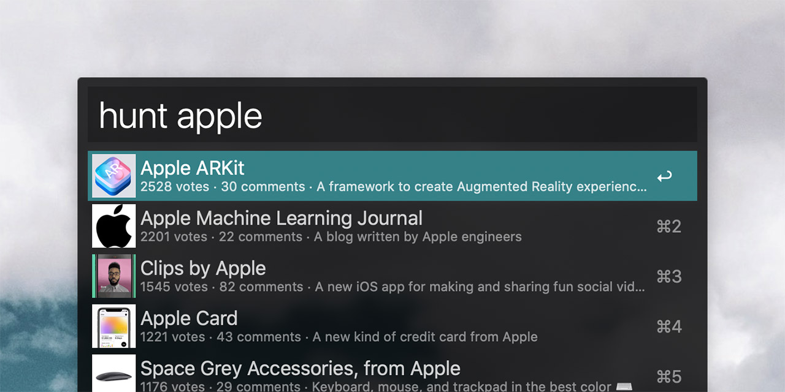

# alfred-producthunt-search

> Alfred search for producthunt

## Installation
**<a download href="https://github.com/nathangathright/alfred-producthunt-search/releases/latest/download/alfred-producthunt-search.alfredworkflow">Download and install the latest release</a>** 

_You will need [Alfred Powerpack](https://www.alfredapp.com/powerpack/) to enable this workflow._

## Usage

1. In Alfred, type `hunt`, <kbd>Enter</kbd>, and your query. Results, including the title, thumbnail, and votes, will populate below.
2. Press <kbd>Return</kbd> to open the Product Hunt post for the selected result.
3. Press <kbd>⌘</kbd> + <kbd>Return</kbd> to open the external link post for the selected result.
4. Press <kbd>⌘</kbd> + <kbd>C</kbd> to copy the URL of the selected result to your clipboard.

## Credits
- Hat tip to [Chris Messina](https://twitter.com/chrismessina) for the nudge to create this
- Built with [alfy](https://github.com/sindresorhus/alfy) via [generator-alfred-algolia](https://github.com/prashantpalikhe/generator-alfred-algolia)

## License

MIT © [Nathan Gathright](https://github.com/nathangathright)
